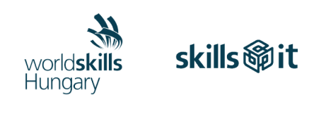
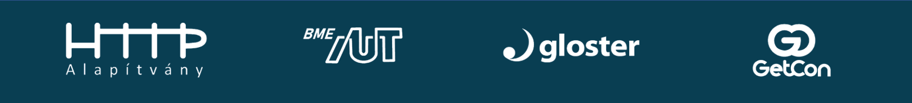

# EuroSkills Herning 2025 Hungarian National Final & WorldSkills Lyon 2024 International Training Competition

## 04.23.2024 - 04.26.2024

### Budapest, Hungary

## Schedule

### C-1

04/23/2024, Tuesday

- Arrival at the hotel
- 19:00-20:00 Dinner together in the hotel restaurant (optional)

### C1

04/24/2024, Wednesday

- 08:00-08:30 Arrival at the competition area
- 08:30-09:00 Opening meeting
- 09:00-09:45 Familiarisation
- 10:00-11:30 Szakma Sztár Opening Ceremony
- 11:30-12:30 Module A - Speed Test
- 12:30-13:30 Lunch break
- 13:30-16:30 Module B - Design and Implementation
- 16:30-16:45 Closing meeting of the day
- 17:00-19:00 Marking

### C2

04/25/2024, Thursday

- 08:00-08:30 Arrival at the competition site
- 08:30-09:00 Opening meeting
- 09:00-10:30 Module C - Backend
- 10:30-12:00 Module D - Backend and Admin
- 12:00-13:00 Lunch break
- 13:00-16:00 Module E - Frontend
- 16:00-16:15 Closing meeting
- 16:30-19:00 Marking

### C+1

04/26/2024, Friday

- 08:30-09:15 Announcement of results (optional, only for our skills, location: the ground floor of our hotel)

## Test Project

- [Overview](modules-overview.md)
- [Module A - Speed Test](module-a.md)
- [Module B - Design and Implementation](module-b.md)
- [Module C - Backend](module-c.md)
- [Module D - Admin](module-d.md)
- [Module E - Frontend](module-e.md)

