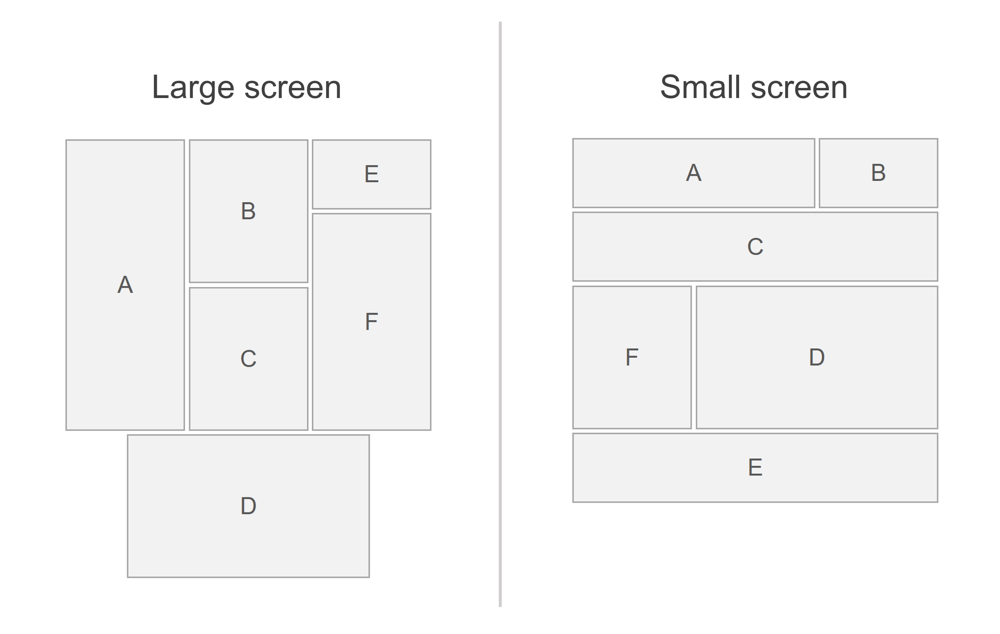

# Module A – Speed test

## Overview

In this module, you must complete a number of independent tasks. The tasks are designed to test your HTML, CSS, and JavaScript skills.

In the module repo, you see 5 folders, one for each task. Inside a folder, you see a few files. You can add your code where marked with a `/* Your code here */` comment and do **not** modify any code provided as the skeleton for the task.

## Tasks

### Task 1 – Sum of two largest integers

Write a function that takes an array of integers as input and returns the sum of the two largest integers in the array. The function should return 0 if the array has fewer than two elements.

The function should have the following signature:

```typescript
function sumOfTwoLargestIntegers(numbers: number[]): number;
```

Examples:
Input | Output
--- | ---
`[1, 2, 3, 4, 5]` | `9`
`[5, 5, 5, 5, 5]` | `10`
`[1]` | `0`
`[]` | `0`

---

### Task 2 – Sales statistics

Create a function that takes a list of sales and returns the following statistics:

- Number of sales
- Total revenue
- Average revenue per sale
- The most sold item

The function should have the following signature:

```typescript
function getStatistics(sales: { items: { name: string; price: number }[] }[]): {
  numberOfSales: number;
  totalRevenue: number;
  averageRevenuePerSale: number;
  mostSoldItem: string;
};
```

**Example:**

Input:

```typescript
[
  {
    items: [
      { name: "Grilled chicken", price: 1200 },
      { name: "French fries", price: 600 },
      { name: "Coca-Cola", price: 400 },
    ],
  },
  {
    items: [
      { name: "Grilled chicken", price: 1200 },
      { name: "Coca-Cola", price: 400 },
    ],
  },
  {
    items: [
      { name: "French fries", price: 600 },
      { name: "Coca-Cola", price: 400 },
    ],
  },
];
```

Output:

```typescript
{
	numberOfSales: 3,
	totalRevenue: 4800,
	averageRevenuePerSale: 1600,
	mostSoldItem: 'Coca-Cola'
}
```

---

### Task 3 – Analog clock

Using HTML, CSS, and JavaScript, create an analog clock that displays the current time. The clock should be updated every second.

The clock should have a circular clock face with an hour hand, a minute hand, and a second hand. The hands should be of different lengths and colors.
The clock face does not need to display numbers or other markings.

---

### Task 4 – Responsive layout

Create a responsive layout of boxes that corresponds to the image below. The layout should be implemented using HTML and CSS. Each box should appear only once in the DOM tree. The breakpoint for the layout change is 768px screen width.

The boxes should contain the letters centered in the middle of the box. The exact dimensions are not specified, but the proportions of the boxes compared to each other should match the image.



---

### Task 5 – Receipt printing

Write a function that takes a list of items and their prices and returns a receipt in the form of a string.

The function should have the following signature:

```typescript
function createReceipt(items: { name: string; price: number }[]): string;
```

The receipt should contain the following information:

- The name of the store: `DineEase Restaurant`
- The current date and time, formatted as `YYYY-MM-DD HH:MM:SS`
- The list of items with their prices
- The total price of all items

The receipt should be formatted as shown in the example below.
Each line should be 38 characters long. The restaurant name, the date, and the thank you message should be centered. The prices should be right-aligned.

**Example:**

Input:

```typescript
[
  { name: "Grilled chicken", price: 1200 },
  { name: "French fries", price: 600 },
  { name: "Coca-Cola", price: 400 },
];
```

Output:

```

          DineEase Restaurant
           2024-04-24 09:00

Item                           Price
--------------------------------------
Grilled chicken                   1200
French fries                       600
Coca-Cola                          400
--------------------------------------
Total                             2200
--------------------------------------

      Thank you for your visit!

```

---
