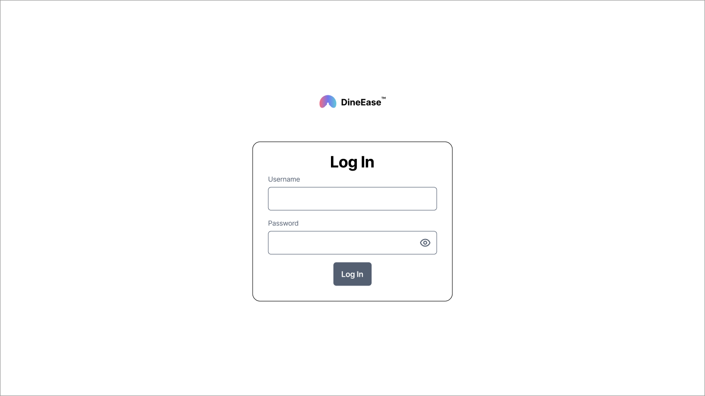
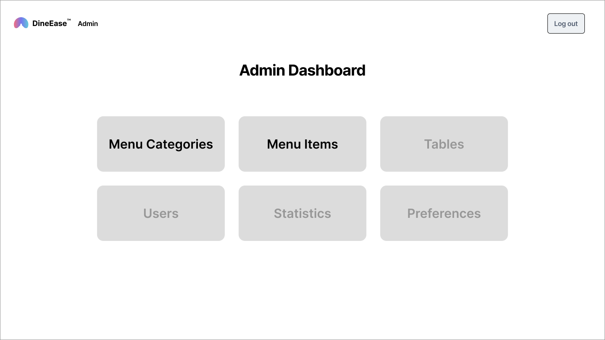
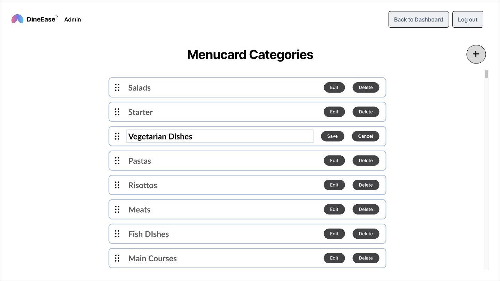
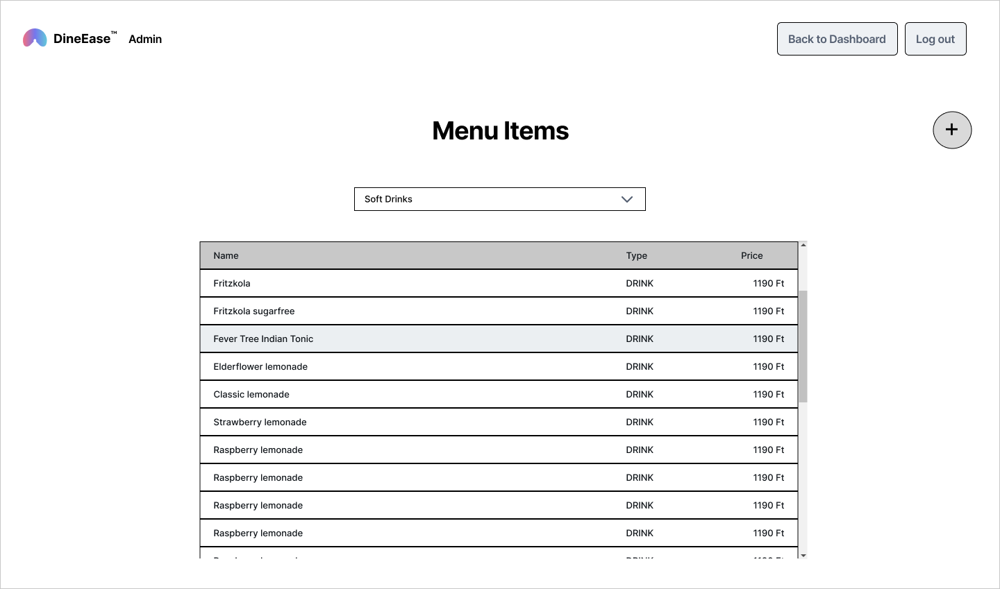
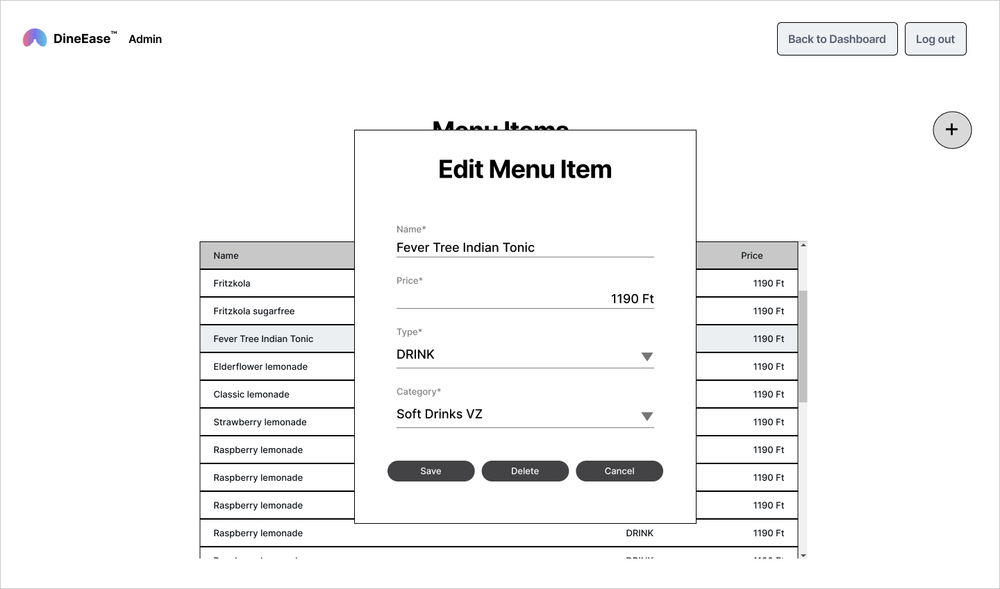

# Module D - Dineease Ordering App Admin (1.5 hours)

## Overview

In this module, you are tasked with creating a simplified version of the admin application for the Dineease restaurant software, focusing primarily on menu management. This version of the admin application will not include a user interface for all functions but will centralize on backend functionality to manage menu effectively. The project emphasizes developing user-experience-oriented admin application. Participants will utilize an already implemented `/login` and `/logout` endpoints for secure authentication, design a navigational dashboard, and facilitate comprehensive management of menu categories and items.

Design is not a priority in this module, but smooth operation and user experience are expected. Wireframes are available for implementation. You do not have to strictly adhere to this during implementation, but all the structural elements shown on the wireframes must be created.

## Tasks

### Task 1: Implement Authentication

- **Description**: Implement authentication to secure the admin application for admin users.
- **Requirements**:
  - Create a login form that authenticates the user by username and password.
  - Utilize token-based authentication to maintain user sessions and ensure persistence across browser refreshes.
  - Redirect users to the dashboard page upon successful login.
    

### Task 2: Dashboard Page

- **Description**: Construct a dashboard page featuring prominent, clickable buttons for various admin functionalities.
- **Requirements**:
  - Display buttons for "Menu Categories," "Menu Items," "Tables," "Users," "Statistics," and "Preferences."
  - Make only "Menu Categories" and "Menu Items" buttons clickable, leading to their respective functionalities.
  - Present "Tables," "Users," "Statistics," and "Preferences" buttons as visible but disabled, indicating these features are planned for future development.
  - Include "Back to Dashboard" and "Logout" buttons on all pages (except the login page and "Back to Dashboard" button on Dashboard Pag ) to enhance navigation and security.
    

### Task 3: Logout Functionality

- **Description**: Implement functionality to securely end the admin session.
- **Requirements**:
  - Invalidate the session token upon logout.
  - Redirect users to the login page following session termination.

### Task 4: Menu Categories Management

- **Description**: Enable functionalities for managing menu categories, including their listing, ordering, editing, and deletion.
- **Requirements**:
  - Categories should be displayed in order of priority (with the lowest priority item at the top).
  - Facilitate category reordering via drag and drop, with changes persisting in the database. (You may create the droppable areas between the elements.)
  - Allow inline editing of category names, incorporating validation to reject empty entries.
  - Add a feature to delete an existing category. Permit category deletion only if no menu items are linked to the category.
  - Add a feature for creating new categories, with immediate entry and editing of the category name upon creation. The new item should be placed in the first position.
    

### Task 5: Menu Items Management

- **Description**: Manage menu items through functionalities that allow listing by category, item editing, and deletion.
- **Requirements**:
  - Implement a category dropdown to filter items, with the first category selected by default. Display in a table all menu items belonging to the selected menu category.
  - When the user clicks on the row of a menu element, a modal editing window appears, in which it is possible to edit the element's data and delete the element.
  - The editing modal containing item details for modification, including name, price, type (FOOD/DRINK/OTHER) and category, along with `Save` `Delete` and `Cancel` buttons. While the modal is visible, the background elements are inactive.
  - The delete button should be inactive when the menu item has one or more menu items associated with it.
    
    
  - Add a feature to create new menu elements. When the user clicks the add (+) button, the editor modal appears. The name field and the price are empty; the selected type is "FOOD" by default, and the default category is the same as the category selected on this page.

## Evaluation Criteria

Submissions will be assessed on:

- Effective implementation of authentication and session management.
- The functionality and user experience provided by the dashboard and menu management features.
- The quality, organization, and documentation of the code.
