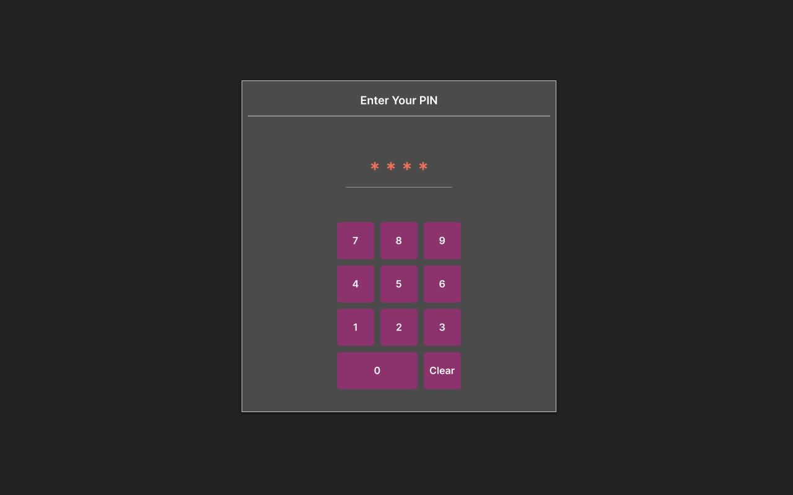
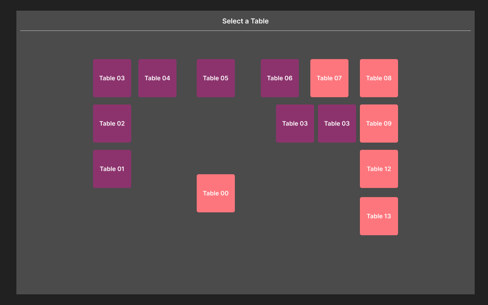
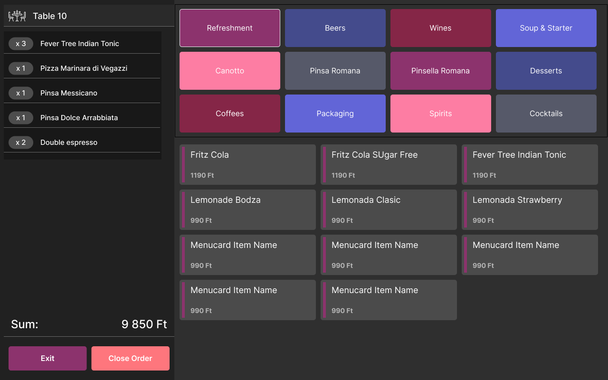

# Module E - DineEase Restaurant Software Frontend

## Overview

In this module, participants are tasked with creating a simplified version of the ordering application for the Dineease restaurant software.

Waiters of the restaurant will use this application to take orders from customers. After logging in with their PIN, they can select a table, add items to the order, and close the order when the customer is ready to pay.

## Tasks

The application is expected to be easy to use on a tablet of 1280x800 screen size. Optimisation for other display sizes is a future development.

### Login Screen

When the application is opened, the user is prompted to log in with their PIN code. The user can only log in if they have the `WAITER` role. To enter the PIN, user will see an on-screen keypad with numbers from 0 to 9 and a `Clear` key. The `Clear` key clears the entered numbers. If the waiter has entered all four numbers, the authentication will start automatically. After successful login, the user is redirected to the table selection screen. In case of an incorrect PIN, an error message "Incorrect PIN. Try again!" will be displayed in the window and the numbers entered so far will be deleted. As soon as the waiter enters another number, the error message disappears.

All other functionalities are disabled until the user logs in.

The user should stay logged in until the browser is restarted or the page is refreshed.

### Table Selection Screen

The user can select a table from the list of available tables. The tables should be displayed in a visual map according to their `x`, `y` coordinates and `width`, `height` dimensions. Tables where there is an open order are displayed in a different colour. After selecting a table, the user is redirected to the ordering screen.

### Ordering Screen

The ordering screen should consist of the following elements:

- Name of the currently selected table
- Menu category selection
- Menu items
- Current order's items
- Total price
- `Exit` and `Close Order` buttons

#### Currently selected table

The name of the table that the user has selected is displayed at the top of the screen.

#### Menu category selection buttons

The user can select a menu category from the list of available categories. The categories should be displayed as buttons on the screen. The user can only select one category at a time, and the first category should be selected by default. The selected category should be highlighted.

#### Menu items

The user can see the items of the currently selected category. The item's name and price should be visible. The items should be displayed as buttons on the screen. The user can add an item to the order by clicking on the item button (creating a new `OrderItem` with the quantity 1 every time, even if already added to the list. Optimising this feature is planned at a later milestone).

#### Current order's items

On the left side of the screen, the user can see the items that are currently in the order. The item's name and quantity should be visible. Every menu item should appear only once; therefore, the quantities should be aggregated from multiple order items of the same menu item. The list should be ordered according to the date of addition, with the most recent item at the top.

#### Total price of the current order

The total price of the current order should be displayed at the bottom of the screen. The price should be updated whenever an item is added to the order.

#### Exit and Close buttons

The user can exit the ordering screen by clicking the `Exit` or `Close` button. Clicking the `Exit` button will redirect the user to the table selection screen without closing the order. Clicking the `Close Order` button will close the order, displaying a `Printing bill...` message as an overlay for 5 seconds, then redirect the user to the table selection screen.

# Evaluation Criteria

Submissions will be evaluated based on the following criteria:

- **Functionality**: The application should meet the requirements specified in the tasks.
- **User Experience**: The application should be easy to use and navigate.
- **Code Quality**: The code should be well-structured, easy to read, and follow best practices.
- **Adherence to design**: The application should follow the provided design guidelines.
