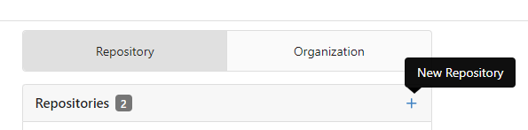

# Modules Overview

**EuroSkills Herning 2025 Hungarian National Competition, Web Development - Round 3**

Submitted by: [Skills IT](https://skillsit.hu)

## Introduction:

**DineEase**, a small startup based in Hungary, initially made waves in the restaurant industry with its innovative restaurant software. Now, they are expanding their horizons with a brand new service that aims to revolutionize how people discover, explore, and engage with restaurants. In the DineEase all-in-one portal, visitors can choose between restaurants, view the full menu of any restaurant, and read reviews from previous guests about the restaurant's service and food. They can also book a table at the restaurant of their choice and order and pay through the website or the app.

You used to work as a freelance web developer, but now you've applied for a job as a developer at DineEase. The company's management wants to test your skills, so as part of the recruitment process, they asked you to develop the prototype of their new service. You have already completed the first and second rounds of the recruitment process successfully, and you have been selected from over 100 candidates for the last round, where only the top seven candidates are left.

In this round, you will have five different tasks. First, you'll be tested on a speedtest to see how well you can solve small HTML, CSS and JavaScript problems in a short time. Then, you'll be asked to prototype a promotion site for DineEase's original product, showcasing its innovative restaurant software. On the second day, you will be asked to create a simplified version of a new version of the restaurant software. This includes the creation of the backend, admin and frontend for ordering.

Descriptions of the tasks:

- [Module A - Speedtest](module-a.md)
- [Module B - DineEase Restaurant Software Showcase Website](module-b.md)
- [Module C - DineEase Restaurant Software Backend](module-c.md)
- [Module D - DineEase Restaurant Software Admin](module-d.md)
- [Module E - DineEase Restaurant Software Frontend](module-e.md)

## Technical Environment

You can solve the tasks by developing them on your own machine.

### Gitea, git

For all three tasks, you can start with the selected template repo available on DineEasy Gitea.

The available template repos:

- react-app
- react-ts-app
- vue-app
- vue-ts-app
- laravel
- node-app
- node-ts-app

The Gitea service is available at the following address:
[https://gitea.dineease.com](https://gitea.dineease.com)

To log in, you must use the username and password (a 4-digit PIN code) you have been given.
After logging in, create a new repo for the next task.

- In the Owner field, select `competitors` team! **Make sure you set this option carefully because if you set your own user as owner, the automatic deployment will not work!**
- Give the name of the new repo using the following pattern: `module-x-s`, where `x` is the letter of the module and `s` is your station number. For example, if your station number is `8`, your module-c repo name should be `module-c-8`. **Make sure you set the repo's name carefully because if you make a mistake, the automatic deployment will not work!**
- Under the template field, select the appropriate template (e.g. `react-ts-app`). Select `Git Content (Default Branch)` for `Template Items`.

Once the new repo is created, clone it to your own workstation inside the `d:\es2025-s17-r3` folder.

### Using npm modules

The npm modules will be accessible via a local npm cache. This means that even though there will be no internet access to the machines, you will be able to add the available npm modules to the projects as usual, and the `npm install` command issued on the cloned template projects will install all the npm modules needed for your project.

The available npm modules:

- express
- mysql2
- vue-router
- react-router, react-router-dom
- axios
- sass
- prisma, @prisma/client
- express-validator
- zod
- tailwindcss
- postcss
- autoprefixer

### Laravel projects, composer install

The Laravel project contains all the necessary files, so you will not need to `composer install`. Your workstation has PHP 8 installed, so you can use the `php artisan` commands in the Laravel project.

### Deployment

When you commit and push your work, the deployment will start automatically. You can follow the process in the Gitea interface under the Action tab. Once the deployment is complete, your project will be available at `https://module-x-s.dineease.com`, where `s` is your station number and `x` is the letter of the module.

### Database access

You will have your own database on the MySQL database server (`db.dineease.com`) available on the local network. You will need to use this database for development, and the same database will provide the data for your projects deployed to the server. A database dump will be provided to provide the initial data. During the marking, the database will be restored to its original state using the same dump.
